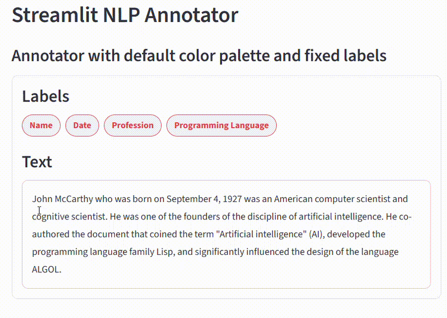
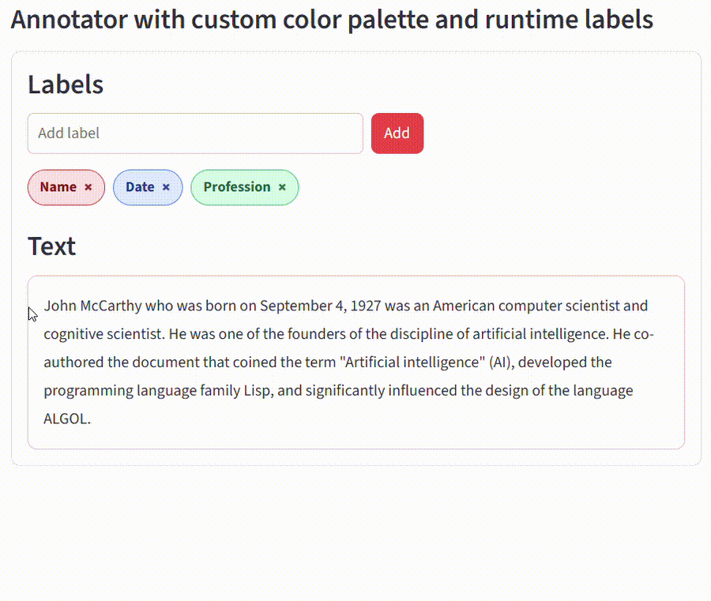
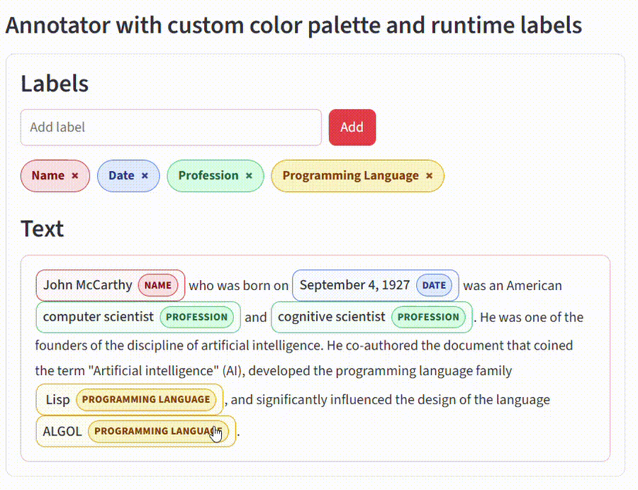

# streamlit-nlp-annotator
[](https://pypi.org/project/streamlit-nlp-annotator/)

`streamlit-nlp-annotator` is a Streamlit component for interactive text annotation. This is especially useful for Natural Language Processing (NLP) tasks.

This component was inspired by the following works:
- [st-annotated-text](https://github.com/tvst/st-annotated-text) by [@tvst](https://github.com/tvst)
- [streamlit-annotator](https://github.com/EttoreCaputo/streamlit-annotator) by [@EttoreCaputo](https://github.com/EttoreCaputo)
- [streamlit-annotation-tools](https://github.com/rmarquet21/streamlit-annotation-tools) by [@rmarquet21](https://github.com/rmarquet21)

Unlike existing tools, `streamlit-nlp-annotator` allows a clean inline visualization of annotations.


## 👀 Features

- Inline annotations with visible labels
- Span selection with mouse
- Label assignment via popup
- Editable and removable annotations
- Deterministic color mapping
- JSON-compatible output format
- Supports controlled label sets
- Optional runtime label creation
- Light/dark theme support

## 🎬 Demo

### Live App
👉 Test it [here](https://nlp-annotator.streamlit.app/)

### Preview

<p align="center">
  
  
</p>
<p align="center">
  

</p>

## 🛠️ Installation

```bash
pip install streamlit-nlp-annotator
```


## 🚀 Quick Start
```python
import streamlit as st
from streamlit_nlp_annotator import annotate_text

text = "John McCarthy was born on September 4, 1927."

result = annotate_text(
    text=text,
    labels=["Name", "Date"],
    allow_runtime_labels=True,
    key="example",
)

st.write(result)
```

## 💾 Output Format

The component returns a dictionary-like structure:
```json
{
    "annotations": [
        {
            "id": "...",
            "start": 0,
            "end": 3,
            "label": "Name",
            "text": "John"
        }
    ],
    "labels": ["Name", "Date"],
    "selection": {
        "start": 26,
        "end": 42,
        "text": "September 4, 1927"
    }
}
```

The above example shows the output when one part of the text has already been annotated, and another text portion has only been selected. The list of available labels is also provided.


## ⚙️ API
```python
annotate_text(
    text: str,                              # Source text to annotate
    labels: list[str] | None = None,        # Initial list of labels
    annotations: list[dict] | None = None,  # Initial annotations
    allow_runtime_labels: bool = True,      # Allow users to add/remove labels
    readonly: bool = False,                 # Disable editing
    colorPalette: dict | None = None,       # Optional custom color palette
    themeMode: str = "light",               # "light" or "dark"
    key: str | None = None,                 # Streamlit key for persistence
)
```

## ✅ Example App

```bash
streamlit run example.py
```

## License

MIT License
